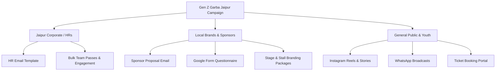

# 🚀 Gen Z Garba Party: Email Marketing & Sponsor Campaign Strategy

This guide details the complete roadmap discussed in your team's plan (extracting Jaipur HRs & local businesses, utilizing manageplus.io trial/CRM, and converting sponsors).

---

## 🎯 Target Audiences & Campaign Pillars

---

## 📧 1. Email Marketing Setup (Using manageplus.io / CRM)

### Step 1: Lead List Preparation (Jaipur HRs & Businesses)
- Export your scraped / extracted contacts into a clean `.csv` file with the following columns:
  - `First_Name`, `Company_Name`, `Email`, `Phone_Number`, `Industry_Type`
- Clean and verify email deliverability (remove invalid formats to avoid spam flags).

### Step 2: Upload & Segmentation in CRM
- Create 2 distinct lists:
  1. **Jaipur_HR_Corporates** (Target: IT companies, BPOs, startups, local corporate offices)
  2. **Jaipur_Sponsors_Brands** (Target: Cafes, jewelers, ethnic wear boutiques, real estate, FMCG brands)

### Step 3: Sending Campaigns
- Open the email template HTML files located in the `email_templates/` folder:
  - `hr_corporate_invite.html` for HR list
  - `sponsor_invitation.html` for Brand Sponsor list
- Copy the HTML directly into the manageplus.io / CRM rich code editor.
- Ensure merge tags (e.g., `{{First_Name}}`, `{{Company_Name}}`) are mapped correctly.

---

## 📝 2. Google Form Setup for Sponsors

Create a Google Form named **"Gen Z Garba Party 2026 — Sponsor & Partner Inquiry"** with the following fields:

1. **Company / Brand Name** (Short answer)
2. **Contact Person Name & Designation** (Short answer)
3. **WhatsApp / Phone Number** (Phone field)
4. **Email Address** (Email field)
5. **Industry / Category** (Multiple Choice: *Food & Beverage, Fashion/Apparel, Real Estate, Education/EdTech, Lifestyle/Beauty, Other*)
6. **Interested Sponsorship Tier:**
   - [ ] Title Sponsor (Sole naming rights, main LED stage branding, VIP Lounge, Stall)
   - [ ] Co-Powered By Sponsor (Stage banner, product booth, influencer shoutouts)
   - [ ] Stalls & Experience Zone (Food/Product display kiosk)
   - [ ] Gifting / Award Partner (Sponsoring "Best Dressed" gifts & hampers)
7. **Any specific requirements or budget expectations?** (Paragraph)

> 💡 **Tip:** Add a webhook or email notification on form submission so your partnership coordinator can call them within 2 hours!

---

## 📊 3. Content Publishing Calendar (Leading up to Oct 17–19)

| Timeline | Reel / Social Post Focus | Email / WhatsApp Action |
| :--- | :--- | :--- |
| **Week 1 (Announcement)** | Concept 1: Fast Beat-Sync ("Jaipur's Biggest Garba Vibe") | Blast Email 1 to HRs & Sponsors; WhatsApp status launch |
| **Week 2 (Perks & Excitement)** | Concept 2: POV Expectation vs Reality (Solo friendly, Live Band) | Follow-up Email with Google Form for high-intent sponsors |
| **Week 3 (FOMO & Outfits)** | Concept 3: Festive Aesthetic / Best Dressed Award | Corporate group discount reminder & last-call passes |
